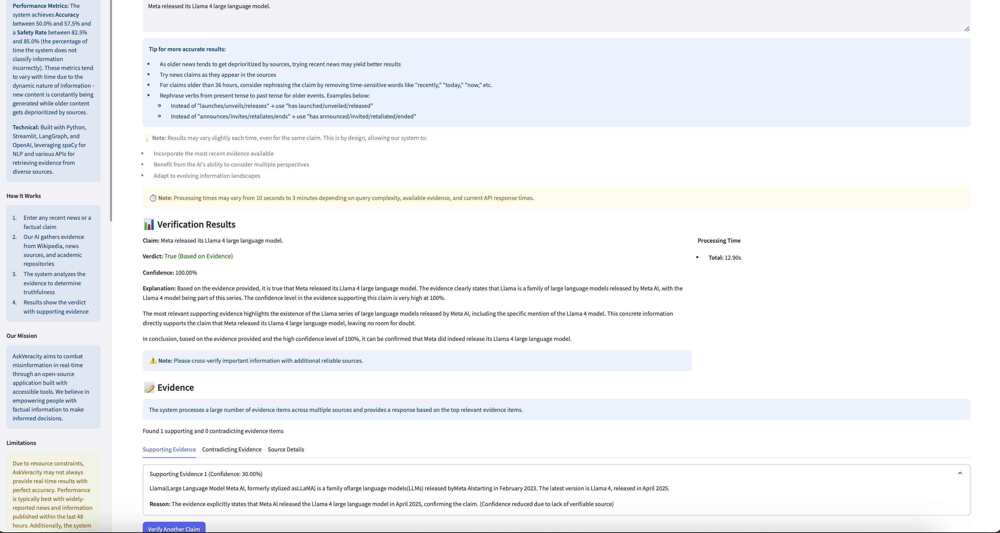

# AskVeracity: Fact Checking System

[](https://huggingface.co/spaces/ankanghosh/askveracity)
[](https://opensource.org/licenses/MIT)

A streamlined web application that analyzes claims to determine their truthfulness through evidence gathering and analysis, supporting efforts in misinformation detection.

<p align="center">
  
</p>

## Overview

AskVeracity is an agentic AI system that verifies factual claims through a combination of NLP techniques and large language models. The system gathers and analyzes evidence from multiple sources to provide transparent and explainable verdicts.

The AI agent:
1. Uses a ReAct (Reasoning + Acting) methodology to analyze claims
2. Dynamically gathers evidence from multiple sources, prioritized by claim category
3. Applies semantic analysis to determine evidence relevance
4. Classifies the truthfulness of claims with confidence scores
5. Provides transparency into its reasoning process
6. Generates clear explanations for its verdict

## Key Features

- **Intelligent Claim Extraction:** Extracts and focuses on the primary factual claim
- **Category Detection:** Automatically identifies claim categories for optimized evidence retrieval
- **Multi-source Evidence Gathering:** Collects evidence from:
  - Wikipedia and Wikidata
  - News articles
  - Academic sources via OpenAlex
  - Fact-checking websites
  - Category-specific RSS feeds
- **Enhanced Entity Matching:** Uses improved entity and verb matching for accurate evidence relevance assessment
- **Category-Specific Fallbacks:** Ensures robust evidence retrieval with domain-appropriate fallbacks
- **Transparent Classification:** Provides clear verdicts with confidence scores
- **Safety-First Classification:** Prioritizes avoiding incorrect assertions when evidence is insufficient
- **Detailed Explanations:** Generates human-readable explanations for verdicts
- **Interactive UI:** Easy-to-use Streamlit interface with evidence exploration options
- **Claim Formatting Guidance:** Helps users format claims optimally for better results

## System Architecture

AskVeracity is built with a modular architecture:

```
askveracity/
│
├── agent.py                   # LangGraph agent implementation
├── app.py                     # Main Streamlit application
├── config.py                  # Configuration and API keys
├── evaluate_performance.py    # Performance evaluation script
│
├── modules/                   # Core functionality modules
│   ├── claim_extraction.py    # Claim extraction functionality  
│   ├── evidence_retrieval.py  # Evidence gathering from various sources
│   ├── classification.py      # Truth classification logic
│   ├── explanation.py         # Explanation generation
│   ├── rss_feed.py            # RSS feed evidence retrieval
│   └── category_detection.py  # Claim category detection
│
├── utils/                     # Utility functions
│   ├── api_utils.py           # API rate limiting and error handling
│   ├── performance.py         # Performance tracking utilities
│   └── models.py              # Model initialization functions
│
├── results/                   # Performance evaluation results
│   ├── performance_results.json # Evaluation metrics
│   └── *.png                  # Performance visualization charts
│
└── docs/ # Documentation
   ├── assets/ # Images and other media
   │   └── app_screenshot.png # Application screenshot
   ├── architecture.md # System design and component interactions
   ├── configuration.md # Setup and environment configuration
   ├── data-handling.md # Data processing and flow
   └── changelog.md # Version history
```

## Claim Verification Process

1. **Claim Extraction:** The system extracts the main factual claim from user input
2. **Category Detection:** The claim is categorized (AI, science, technology, politics, business, world, sports, entertainment)
3. **Evidence Retrieval:** Evidence is gathered from multiple sources with category-specific prioritization
4. **Evidence Analysis:** Evidence relevance is assessed using entity and verb matching
5. **Classification:** A weighted evaluation determines the verdict with confidence score
6. **Explanation Generation:** A human-readable explanation is generated
7. **Result Presentation:** Results are presented with detailed evidence exploration options

## Setup and Installation

### Local Development

1. Clone this repository
   ```
   git clone https://github.com/yourusername/askveracity.git
   cd askveracity
   ```

2. Install the required dependencies:
   ```
   pip install -r requirements.txt
   ```

3. Download the required spaCy model:
   ```
   python -m spacy download en_core_web_sm
   ```

4. Set up your API keys:
   
   **Option 1: Using Streamlit secrets (recommended for local development)**
   
   - Create a `.streamlit/secrets.toml` file with your API keys:
     ```toml
     OPENAI_API_KEY = "your_openai_api_key"
     NEWS_API_KEY = "your_news_api_key"
     FACTCHECK_API_KEY = "your_factcheck_api_key"
     ```

   **Option 2: Using environment variables**
   
   - Set environment variables directly or create a `.env` file:
     ```
     OPENAI_API_KEY=your_openai_api_key
     NEWS_API_KEY=your_news_api_key
     FACTCHECK_API_KEY=your_factcheck_api_key
     ```

5. Run the application:
   ```
   streamlit run app.py
   ```

### Deploying to Hugging Face Spaces

1. Create a new Space on Hugging Face:
   - Go to https://huggingface.co/spaces
   - Click "Create new Space"
   - Select "Streamlit" as the SDK
   - Choose the hardware tier (recommended: 16GB RAM)

2. Add the required API keys as secrets:
   - Go to the "Settings" tab of your Space
   - Navigate to the "Repository secrets" section
   - Add the following secrets:
     - `OPENAI_API_KEY`
     - `NEWS_API_KEY`
     - `FACTCHECK_API_KEY`

3. Push your code to the Hugging Face repository or upload files directly through the web interface

## Configuration Options

The system includes several configuration options in `config.py`:

1. **API Rate Limits:** Controls request rates to external APIs
   ```python
   RATE_LIMITS = {
       "newsapi": {"requests": 100, "period": 3600},  # 100 requests per hour
       "factcheck": {"requests": 1000, "period": 86400},  # 1000 requests per day
       # Other API limits...
   }
   ```

2. **Error Handling:** Configures retry behavior for API errors
   ```python
   ERROR_BACKOFF = {
       "max_retries": 5,
       "initial_backoff": 1,  # seconds
       "backoff_factor": 2,  # exponential backoff
   }
   ```

3. **RSS Feed Settings:** Customizes RSS feed handling
   ```python
   RSS_SETTINGS = {
       "max_feeds_per_request": 10,
       "max_age_days": 3,
       "timeout_seconds": 5,
       "max_workers": 5
   }
   ```

4. **Category-Specific RSS Feeds:** Defined in `modules/category_detection.py` for optimized evidence retrieval

## Performance Evaluation and Development

The system includes a performance evaluation script that tests the fact-checking capabilities using predefined claims:

```bash
python evaluate_performance.py [--limit N] [--output FILE]
```

The evaluation measures:
- **Accuracy:** How often the system correctly classifies claims
- **Safety Rate:** How often the system avoids making incorrect assertions
- **Processing Time:** Average time to process claims
- **Confidence Scores:** Average confidence in verdicts

Detailed results and visualizations are saved to the `results/` directory. These results are not tracked in the repository as they will vary based on:
- The evolving nature of available evidence
- News sources constantly updating and deprioritizing older content
- Changes in the recency and relevance of test claims

Developers should update the claims in `evaluate_performance.py` to use fresh, relevant examples and run the evaluation script to generate current performance metrics. This ensures that performance evaluations remain relevant in the rapidly changing information landscape.

## Recent Improvements

- **Safety Rate Metric:** Added metric to measure how often the system avoids making incorrect assertions
- **Refined Relevance Scoring:** Implemented weighted scoring with entity and verb matching with keyword fallback for accurate evidence relevance assessment during classification
- **Enhanced Evidence Relevance:** Improved entity and verb matching with weighted scoring prioritization and increased evidence gathering from 5 to 10 items
- **Streamlined Architecture:** Removed source credibility and semantic analysis complexity for improved maintainability
- **Category-Specific Fallbacks:** AI claims fall back to technology sources; other categories fall back to default RSS feeds
- **OpenAlex Integration:** Replaced Semantic Scholar with OpenAlex for academic evidence
- **Improved User Experience:** Enhanced claim processing and result presentation
- **Better Robustness:** Improved handling of specialized topics and novel terms

## Limitations

AskVeracity has several limitations to be aware of:

- Performance is best for widely-reported news and information published within the last 48 hours
- The system evaluates claims based on current evidence - claims that were true in the past may be judged differently if circumstances have changed
- Technical or very specialized claims may receive "Uncertain" verdicts if insufficient evidence is found
- Non-English claims have limited support
- The system is designed to indicate uncertainty when evidence is insufficient
- Results can vary based on available evidence and LLM behavior

## License

This project is licensed under the [MIT License](./LICENSE), allowing free use, modification, and distribution with proper attribution.

## Blog and Additional Resources
Read our detailed blog post about the project: [AskVeracity: An Agentic Fact-Checking System for Misinformation Detection](https://researchguy.in/anveshak-spirituality-qa-bridging-faith-and-intelligence/)

## Acknowledgements
- Built with [LangGraph](https://github.com/langchain-ai/langgraph) and [Streamlit](https://streamlit.io/)
- Uses OpenAI's API for language model capabilities
- Leverages open data sources including Wikipedia, Wikidata, and various RSS feeds

## Contact

For questions, feedback, or suggestions, please contact us at ankanatwork@gmail.com.
